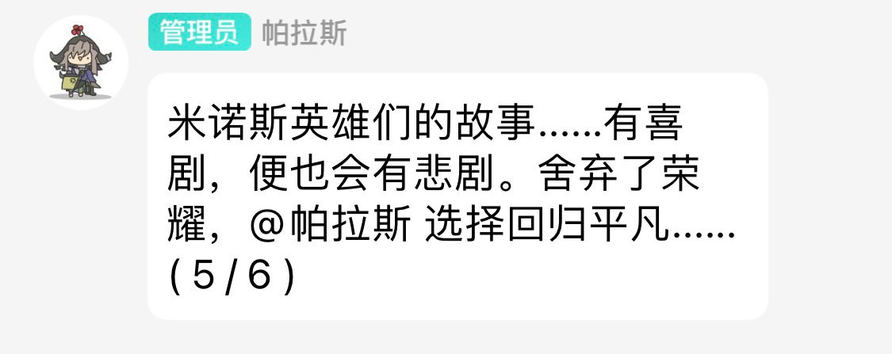

<div align="center">
  
  <h1>Pallas-Bot</h1>

  <pre><code>「我是来自米诺斯的祭司帕拉斯，会在罗德岛休息一段时间......虽然这么说，我渴望以美酒和戏剧被招待，更渴望走向战场。」</code></pre>

  <p>
    <a href="https://github.com/PallasBot/Pallas-Bot/issues/new/choose">报告 Bug</a> ·
    <a href="https://github.com/PallasBot/Pallas-Bot/issues/new/choose">提出新特性</a>
  </p>
</div>

<div align="center">

[](./LICENSE)
[](https://www.python.org)
[](https://nonebot.dev/)
[](https://github.com/PallasBot/Pallas-Bot/stargazers)


[](https://qm.qq.com/q/yIiAajYwms)
[](#qq-群)

</div>

<p align="center"><b>牛牛就是复读机</b>——群友说什么牛牛就说什么。</p>

> 喜欢牛牛，就给牛牛点个 [**⭐**](https://github.com/PallasBot/Pallas-Bot/stargazers) 吧！

## ✨ 特性

- **学习型复读**：记住群友说话，在合适时机复读出来
- **复读优先**：可选接入 LLM 辅助，回复仍以群友语料为主
- **插件化**：内置插件与本地扩展，按需启用
- **WebUI 控制台**：浏览器管理配置、插件与权限
- **可选能力**：[](https://github.com/PallasBot/Pallas-Bot-AI) [](https://github.com/PallasBot/Pallas-Bot-AI) [](https://github.com/PallasBot/Pallas-Bot-AI) [](https://PallasBot.github.io/Pallas-Bot-Docs/plugins/maa)

## 🚀 快速开始

> [!NOTE]
> 前置：Python 3.12+、PostgreSQL、可用的 OneBot v11 协议端（如 [NapCat](https://github.com/NapNeko/NapCatQQ)）。

```bash
# 获取代码
git clone https://github.com/PallasBot/Pallas-Bot.git
cd Pallas-Bot

# 安装依赖（推荐 uv）
pip install uv
uv sync

# 主配置（首次部署）
cp config/pallas.example.toml config/pallas.toml
# 编辑 [bootstrap]：监听、superusers、[bootstrap.postgres]

# 开始运行（单进程）
uv run pallas
```

浏览器打开 `http://<主机>:8088/pallas/`，使用启动日志中的口令登录。  
更完整的上手说明见文档站 [快速开始](https://PallasBot.github.io/Pallas-Bot-Docs/guide/quickstart)。

## 📖 文档

部署、配置、插件、迁移与排障见文档站；全网在线牛牛与社区概览见社区中心。

<table>
<tr>
<td><strong>文档站</strong></td>
<td><a href="https://PallasBot.github.io/Pallas-Bot-Docs/"></a></td>
</tr>
<tr>
<td><strong>快速开始</strong></td>
<td><a href="https://PallasBot.github.io/Pallas-Bot-Docs/guide/quickstart"></a></td>
</tr>
<tr>
<td><strong>社区中心</strong></td>
<td><a href="https://stats.pallasbot.top/"></a></td>
</tr>
</table>

## 🧩 相关仓库

| 仓库 | 说明 |
| --- | --- |
| [Pallas-Bot-Docs](https://github.com/PallasBot/Pallas-Bot-Docs) | 文档站源码 |
| [Pallas-Bot-WebUI](https://github.com/PallasBot/Pallas-Bot-WebUI) | 控制台前端 |
| [Pallas-Bot-AI](https://github.com/PallasBot/Pallas-Bot-AI) | AI 对话 / 唱歌 / TTS 服务 |
| [Pallas-Bot-Community-Stats](https://github.com/PallasBot/Pallas-Bot-Community-Stats) | 社区统计与语料中心服务 |
| [community-plugin-index](https://github.com/PallasBot/community-plugin-index) | 社区插件商店索引 |

<details>
<summary><strong>💭 碎碎念</strong></summary>

> V3 走到后来，市面上那些 Bot 已经能接话、能记上下文、能把模型用得很顺；牛牛多半还是群里那台搞怪用的复读机，冷不丁冒出一句，把气氛带歪一点点。
>
> <p align="center">
>   
> </p>
>
> 群友喜欢她，也是喜欢牛牛的神鬼搞怪。可若只停在记语料、偶尔抛一句，在 LLM 已经走进日常的今天，再假装什么都没发生，其实也有点说不过去。
>
> 所以 V4 并不是想给牛牛硬套一张 AI 皮。接上模型，是这个时代绕不开的一步；不接的话，很多「对话」相关的期待，我们自己也接不住。可我仍想把复读放在前面——模型轻轻托一把就好，群友的话才是她真正的声音。这一块也才刚起步，接得还生，偶尔也会闹别扭，还不成熟；但不想让她变成随便哪都能见到的通用聊天壳。
>
> V3 的内核已经有点撑不住了——配置散、约定乱、控制台和运行时也对不太齐，继续堆只会越来越累。于是 V4 把内核与扩展、配置与控制台重新理了一遍；文档站、WebUI、AI、社区统计、插件索引也各自成仓。生态才刚起了个头，后面怎么长，还盼着大家一起养。
>
> 一路走来，我更盼的是：维护的人更好配一点，写插件的人更好下手一点；群里那台复读机还在，只是脚下的地，终于更踏实了一些。

</details>

## 💻 开发与贡献

欢迎通过 [Issues](https://github.com/PallasBot/Pallas-Bot/issues) / PR 参与改进。参与前请阅读 [贡献指南](CONTRIBUTING.md) 与仓库根目录 [AGENTS.md](AGENTS.md)。

<table>
<tr>
<td><strong>公开进展 / 里程碑</strong></td>
<td><a href="https://pallasbot.notion.site/388943646d10813d9ff4dcb70d7c28e8?source=copy_link"></a></td>
</tr>
<tr>
<td><strong>贡献指南</strong></td>
<td><a href="CONTRIBUTING.md"></a></td>
</tr>
<tr>
<td><strong>Agent 约定</strong></td>
<td><a href="AGENTS.md"></a></td>
</tr>
</table>

## 🤝 社区与支持

<a id="qq-群"></a>

### 💬 QQ 群

<table>
<tr>
<td><strong>开发者</strong></td>
<td>
<a href="https://qm.qq.com/q/yIiAajYwms"></a>
<a href="https://app.notion.com/invite/620c7eed0a3087b751896407b8dc8cbf915f3a22"></a>
</td>
</tr>
<tr>
<td><strong>拉牛牛</strong></td>
<td>
<a href="https://qm.qq.com/q/5GjZ2xHeb6"></a>
<a href="http://qm.qq.com/cgi-bin/qm/qr?_wv=1027&k=snSe5PkcmHZrD0OA5Wzl2RAnM-qoAMUc&authKey=T%2FQlcyy31oE7YyMDMd7Yys7utl5a9jP84VYgnknra8Knsq3BhEy5TrwiWK7rG8j6&noverify=0&group_code=1043301356"></a>
</td>
</tr>
<tr>
<td><strong>闲聊</strong></td>
<td>
<a href="https://qm.qq.com/q/8P"></a>
<a href="https://qm.qq.com/q/Qgc6ir7Jk"></a>
</td>
</tr>
<tr>
<td><strong>社区中心</strong></td>
<td><a href="https://stats.pallasbot.top/"></a></td>
</tr>
<tr>
<td><strong>在线部署 / 牛牛</strong></td>
<td>


</td>
</tr>
</table>

### 💝 打赏

请作者喝杯咖啡吧（请备注牛牛项目，感谢你的支持 ✿✿ヽ(°▽°)ノ✿）：

<a href="https://afdian.com/a/misteo">
  
</a>

## 🙏 致谢

- [**MaiBot**](https://github.com/Mai-with-u/MaiBot)：学习与陪伴向聊天机器人项目
- [**gsuid_core**](https://github.com/Genshin-bots/gsuid_core)：多 Bot 插件核心框架
- [**ArknightsGameData**](https://github.com/Kengxxiao/ArknightsGameData)：明日方舟游戏数据；决斗干员表与知识库由远端同步其 `zh_CN/gamedata`
- [**ArknightsGameResource**](https://github.com/yuanyan3060/ArknightsGameResource)：干员头像等资源；决斗 / 知识库头像由此拉取
- [**MaaAssistantArknights**](https://github.com/MaaAssistantArknights/MaaAssistantArknights.git)：明日方舟长草助手 MAA；本项目的远控能力基于其[远程控制协议](https://docs.maa.plus/zh-cn/protocol/remote-control-schema.html)实现
- [**NoneBot2**](https://github.com/nonebot/nonebot2)：跨平台 Python 异步聊天机器人框架
- [**jieba_next**](https://github.com/mxcoras/jieba-next)：基于 Rust 加速的现代中文分词库
- [**beanie**](https://github.com/BeanieODM/beanie)：异步 Python MongoDB ODM
- [**NapCat**](https://github.com/NapNeko/NapCatQQ)：基于 NTQQ 的现代化 Bot 协议端
- [**zhenxun_bot**](https://github.com/zhenxun-org/zhenxun_bot.git)：QQ 群聊机器人项目
- [**Amiya-bot**](https://github.com/AmiyaBot/Amiya-Bot.git)：基于 AmiyaBot 框架的 QQ 聊天机器人
- [**CustomMarkdownImage**](https://github.com/Monody-S/CustomMarkdownImage.git)：基于 Pillow 的可自定义 Markdown 渲染器

## 📈 数据与贡献者

<a href="https://next.ossinsight.io/widgets/official/analyze-repo-stars-history?repo_id=425810267" target="_blank" style="display: block" align="center">
  <picture>
    <source media="(prefers-color-scheme: dark)" srcset="https://next.ossinsight.io/widgets/official/analyze-repo-stars-history/thumbnail.png?repo_id=425810267&image_size=auto&color_scheme=dark" width="721" height="auto">
    
  </picture>
</a>

<a href="https://next.ossinsight.io/widgets/official/analyze-repo-pushes-and-commits-per-month?repo_id=425810267" target="_blank" style="display: block" align="center">
  <picture>
    <source media="(prefers-color-scheme: dark)" srcset="https://next.ossinsight.io/widgets/official/analyze-repo-pushes-and-commits-per-month/thumbnail.png?repo_id=425810267&image_size=auto&color_scheme=dark" width="721" height="auto">
    
  </picture>
</a>

<a href="https://next.ossinsight.io/widgets/official/compose-recent-active-contributors?repo_id=425810267&limit=30" target="_blank" style="display: block" align="center">
  <picture>
    <source media="(prefers-color-scheme: dark)" srcset="https://next.ossinsight.io/widgets/official/compose-recent-active-contributors/thumbnail.png?repo_id=425810267&limit=30&image_size=auto&color_scheme=dark" width="655" height="auto">
    
  </picture>
</a>

感谢各位大佬！

[](https://github.com/PallasBot/Pallas-Bot/graphs/contributors)

## 📄 许可证

本项目采用 [AGPL-3.0](LICENSE)（GNU Affero General Public License v3.0）许可证。
