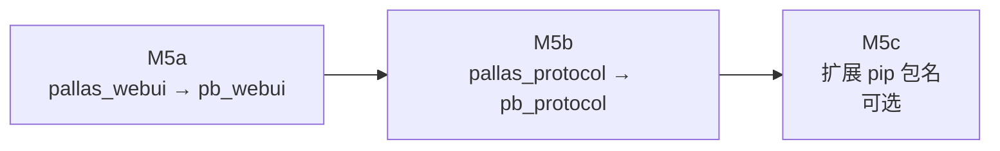
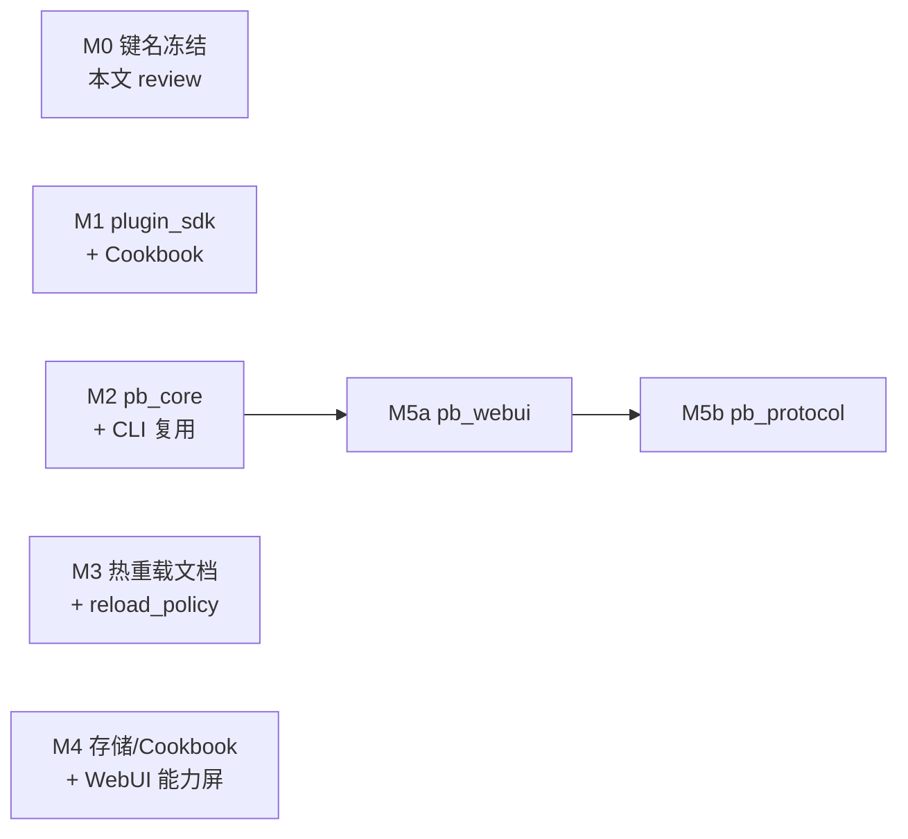

# Core 开发体验路线（plugin_sdk · core_commands · 热重载）

> **状态**：设计草案（M0 键名已敲定） · **分支**：`feat/core-devx`  
> **背景**：多平台适配 ROI 低；QQ 深耕 + 参考 [GsUID Core](https://github.com/Genshin-bots/gsuid_core) 的「用户减负、统一开发、内置命令、成熟热重载」方向。  
> **非目标**：替换 NoneBot matcher、全量代码热载、独立 WS 核心。

## 目标

| 维度 | 目标 | 验收信号 |
| --- | --- | --- |
| 用户减负 | 站长常见运维可在群内完成 | `牛牛状态` / `牛牛控制台` 等口令与 WebUI 行为一致 |
| 高度统一 | 新插件走同一套声明 + SDK | Cookbook 与 golden 插件不再裸拼 `cmd_perm` |
| 易于开发 | 组合式薄 API，不引入继承基类 | 新插件 handler ≤ 30 行样板 |
| 可读性 | core 插件风格一致 | `__init__.py` 以元数据 + 注册为主 |
| 内置命令 | 运维口令集中、可发现 | 单一 core 插件 + help 二级项 |
| 热重载 | 配置 L1 保持；L2/L3 分级补全 | 文档与 WebUI 标明各级生效范围 |

## 现状摘要

**已有（不必重造）**

- 配置热重载：`install_hot_reload_config`（`src/console/webui/plugin_config.py`）
- 声明聚合：`command_permissions`、`command_limits`、`plugin_storage`、`llm_tools` → `plugin_capabilities`
- 统一 CLI：`pallas`（`src/console/cli/`，见 [pallas-cli.md](pallas-cli.md)）
- 文档：Cookbook、Agent Skill、`plugin-convention.md`

**短板**

- 插件作者仍裸用 `on_command` + 手动拼权限/CD/前缀
- 运维能力分散：`help`、`bot_status`（扩展包）、WebUI API
- 存储故事双轨：声明式 `plugin_storage` vs 手写 `store.py` + JSON
- legacy 插件（`repeater`、`duel`）与薄插件风格分裂

---

## 内核键名约定

本节是 **PluginMetadata.extra** 与相关 ID 的**唯一权威表**。新增键须在本表登记。

### 标识符分层：`pb` 与 `nb` 对齐

维护者侧采用与 NoneBot 生态一致的**双字母缩写**：

| 缩写 | 含义 | 典型用途 |
| --- | --- | --- |
| **`nb`** | NoneBot | 运行时、adapter、matcher（`nb run`） |
| **`pb`** | Pallas-Bot | 本体内核插件、core 命令 ID、新内核模块前缀 |

**约定**

1. **新内核 / core 向插件**：包名 `pb_<role>`（如 `pb_core`、`pb_webui`、`pb_protocol`），命令 ID `<包名>.<action>`。
2. **历史 `pallas_*` 插件**：纳入 **M5 渐进改名**（见下文）；改名完成前 loader / help 保留旧包名别名。
3. **用户口令**：仍用中文「牛牛…」，与 `pb` 缩写无关。
4. **CLI 命令面**：继续 `pallas`（产品名）；与代码层 `pb_*` 并存——`pallas status` 实现可落在 `pb_core` 插件。

```text
用户层：牛牛状态 / 牛牛控制台
代码层：pb_core.status / plugins/pb_core/
运行时：NoneBot (nb) 加载 pb_core 插件
运维层：pallas status（CLI 产品名不变）
```

### 命名原则

1. **extra 顶层键**：`snake_case`，语义稳定；已上线键**不改名**（仅 deprecate）。
2. **命令 ID**：`<plugin>.<action>`，全小写 + 下划线；core 运维插件包名固定为 **`pb_core`**。
3. **存储键**（`plugin_storage[].key`）：`<语义>`，不含插件名前缀（插件名由 `GroupPluginStorage(plugin, …)` 提供命名空间）。
4. **help 受众**：`help_audience` 取值 `user`（默认）| `maintainer`。
5. **ingress lane**：`storage` | `remote` | `local`（与 [central-ingress-dispatch.md](central-ingress-dispatch.md) 一致）。

### extra 顶层键一览

| 键 | 状态 | 用途 | 值形状 | 解析/消费方 |
| --- | --- | --- | --- | --- |
| `version` | **稳定** | extra schema 版本标记 | `"3.0.0"`（`PLUGIN_EXTRA_VERSION`） | 文档、未来校验 |
| `menu_template` | **稳定** | 帮助图模板 | `"default"` | `help` 渲染 |
| `command_permissions` | **稳定** | 可配置命令权限默认 | `[{id, label, default}]` | `cmd_perm`、`plugin_capabilities` |
| `command_limits` | **稳定** | 命令默认 CD | `[{id, cd_sec}]`（兼容别名 `cd`） | `command_limits`、`plugin_capabilities` |
| `plugin_storage` | **稳定** | 声明式存储键 | `[{key, scope, label, ephemeral?}]` | `plugin_storage`、`plugin_capabilities` |
| `llm_tools` | **稳定** | LLM 意图→口令工具 | 见 `LlmCommandToolDecl` | `features/llm/tools` |
| `menu_data` | **稳定** | 帮助二级/三级菜单 | 见 [cmd_perm](../common/cmd_perm/README.md) | `help` |
| `ingress_route` | **稳定** | 中央 ingress 分 lane | `{lane, passive?}` | `platform/ingress` |
| `ingress_fanout` | **稳定** | 分片 fanout 明文口令 | `{scope, plaintexts, …}` | `ingress/policy_registry` |
| `exact_plaintexts` | **稳定** | ingress 精确路由 | `["牛牛报数", …]` | `route_index` |
| `command_prefixes` | **稳定** | ingress 前缀路由 | `["牛牛", …]` | `route_index` |
| `help_aliases` | **稳定** | 帮助搜索别名 | `["牛牛聊天", …]` | `help/plugin_match` |
| `disable_scope` | **稳定** | 群开关作用域 | `"group"`（默认）\| `"bot"` | `help/plugin_manager` |
| `hosted_activity_ingress` | **稳定** | 托管活动 ingress 门控 | 见 `hosted_activity_gate` | `platform/ingress` |
| `help_audience` | **稳定** | 插件级 help 受众（维护者向） | `"user"` \| `"maintainer"` | `cmd_perm/help_menu`、部分 `menu_data` 项 |
| `sdk_min_version` | **拟定** | 插件声明依赖的 SDK 版本 | `"1.0.0"` | `plugin_sdk` 启动校验（可选） |
| `reload_policy` | **拟定** | 插件热重载策略 | 见下表 | `console/webui`、未来 `pallas plugin reload` |

**不在 extra 中扩展的项**

- 插件 tier（core/extra/local）：继续由 `plugin_matrix.py` 维护，**不**写入 `extra`（避免双源真相）。
- WebUI 字段：继续走 `config.py` + `install_hot_reload_config`，键名用 **env 大写**（`webui.json`），与 extra 分离。

### menu_data 项内键（稳定）

| 键 | 说明 |
| --- | --- |
| `func` | 功能展示名 |
| `trigger_method` | `on_cmd` / `on_message` / … |
| `trigger_scene` | `SCENE_*` |
| `trigger_condition` | 触发方式文案（不写死权限） |
| `command_permission` / `command_permissions` | 绑定 cmd_perm ID |
| `brief_des` / `detail_des` | 帮助详情 |
| `help_audience` | 可选，覆盖插件级受众 |

### command_permissions / command_limits 行内键

| 键 | 必填 | 说明 |
| --- | --- | --- |
| `id` | 是 | 命令 ID，与 matcher 使用的 ID 一致 |
| `label` | 是 | WebUI / 能力总览展示 |
| `default` | 权限必填 | `superuser` \| `group_moderator` \| `bot_moderator` \| `staff` \| `everyone` |
| `cd_sec` | CD 必填 | ≥0；0 表示无 CD |

辅助构造（已有，P1 继续导出）：

- `command_perm_row` / `command_perm_list`（`features/cmd_perm/declare.py`）
- `command_limit_row` / `command_limit_list`（**P1 新增**，与 perm 对称）
- `plugin_storage_row` / `plugin_storage_list`（已有）

### plugin_storage scope 枚举

| scope | 含义 |
| --- | --- |
| `group` | 按群 |
| `user` | 按用户 |
| `bot` | 按牛牛账号 |
| `deploy` | 全站/部署级（如 help 隐藏名单） |

### reload_policy（拟定）

| 值 | 含义 |
| --- | --- |
| `config_only` | 仅 L1（默认；与现网一致） |
| `metadata` | L2：重读 extra、重注册 help/ingress 索引；**不**卸载 matcher |
| `full` | L3：尝试重载插件模块；失败则提示进程重启 |

首版实现可只文档化三级；CLI `pallas plugin reload` 与 WebUI 按钮在 P3 落地。

### pb_core 命令 ID（已敲定）

| 命令 ID | 默认权限 | 口令 | 后端 API |
| --- | --- | --- | --- |
| `pb_core.status` | `staff` | **牛牛状态** | `pallas status` / `bot_process.status_summary()` |
| `pb_core.console` | `staff` | 牛牛控制台 | WebUI base URL + 登录提示 |
| `pb_core.plugins` | `staff` | 牛牛插件 | `plugin_matrix` + 安装提示 |
| `pb_core.update_check` | `superuser` | 牛牛更新 | `update_ops.check_bot_update()` |
| `pb_core.restart` | `superuser` | 牛牛重启 | `bot_process.request_restart()` |

**PluginMetadata.name**（help 展示）：**牛牛核心**。

**与现有插件边界**

- `help.*`：保留帮助、群级插件开关；**不**迁入 pb_core。
- `bot_status.*`：保留扩展包「牛牛在吗 / 报数 / 邮件」；`pb_core.status`（**牛牛状态**）侧重**进程/分片/CLI 摘要**，与「牛牛在吗」分工明确。
- `service_gateways.*`：保留「牛牛连通」探测；与 status 互补。
- `pb_webui` / `pb_protocol`：控制台与协议端能力；**牛牛控制台**（pb_core）回链 WebUI，不重复实现页面。

---

## P1 · plugin_sdk

### 位置

```
src/features/plugin_sdk/
├── __init__.py          # 公开 API
├── declare.py           # command_limit_row 等（复用 features 层 declare）
├── matcher.py           # group_command / private_command 工厂
├── context.py           # 统一 handler 上下文（event → 常用字段）
└── checklist.py         # 元数据自检（开发/CI 可选）
```

**依赖方向**：`plugin_sdk` → `cmd_perm`、`command_limits`、`foundation.command_prefix`；**不**依赖 `plugins/`。

### API 草案

```python
from src.features.plugin_sdk import group_command, private_command

praise = group_command(
    "praise_me.praise",
    prefixes=["牛牛赞我"],
    cd_sec=60,
    perm_default="everyone",
    label="牛牛赞我",
)

@praise.handle()
async def handle_praise(ctx: PluginHandlerContext):
    ...
```

工厂职责（一次封装）：

1. `on_command` + `matches_command_prefix` / 别名
2. `permission_for_command(command_id)`
3. `is_command_cooldown_ready` / `refresh_command_cooldown`
4. 统一 logger 标签 `[plugin:praise_me]`
5. 可选 `block=True` 默认值

**不做的**：替换 NoneBot 事件类型；不隐藏 `GroupMessageEvent`（QQ 深耕阶段）。

### 与 extra 声明的关系

SDK **不引入新 mandatory extra 键**。插件仍在 `__init__.py` 声明：

```python
extra={
    "command_permissions": command_perm_list(...),
    "command_limits": command_limit_list(...),
    ...
}
```

可选：`sdk_min_version` 供启动时 warn。

### 验收

- [ ] Cookbook「牛牛赞我」改写成 SDK 版
- [ ] `tests/features/plugin_sdk/` 覆盖 perm/CD/前缀
- [ ] Skill / getting-started 指向 SDK

---

## P2 · pb_core 内置命令插件

### 位置

```
src/plugins/pb_core/
├── __init__.py      # PluginMetadata + 注册
├── config.py        # 可选：status 摘要字段开关
├── handlers.py      # 各口令 handler
└── status.py        # 聚合 status 文案（复用 cli/console API）
```

**tier**：加入 `CORE_PLUGIN_NAMES`（`plugin_matrix.py`）。

### 实现原则

1. **群内口令与 CLI/WebUI 共用 Python 模块**（`src/console/cli/*_ops.py`），禁止 handler 内另写 subprocess。
2. `restart` / `update` 必须走现有权限与审计日志；失败返回用户可见原因。
3. help `menu_data` 完整；`usage` 不写死权限等级。

### 验收

- [ ] 五条 core 命令可触发且权限正确
- [ ] 分片角色下 status 摘要含 hub/worker 提示
- [ ] `docs/plugins/pb_core/README.md`

---

## P3 · 热重载分级

| 级别 | 内容 | 现状 | 目标 |
| --- | --- | --- | --- |
| **L1 配置** | WebUI → `webui.json` | ✅ 成熟 | 保持 |
| **L2 元数据** | extra / help 索引 / ingress route | 部分（save hook） | 文档 + `reload_policy: metadata` |
| **L3 插件** | 代码变更 | ❌ 需重启 | `pallas plugin reload` 可控范围 |

**明确不做**（与 [pallas-cli.md](pallas-cli.md) 一致）：NoneBot matcher 级热卸载/重载作为默认路径。

扩展安装：`extension_install` 已有 `needs_restart`；P2 后 WebUI「安装并重启」与 `牛牛重启` 共用 restart API。

---

## P4 · 存储统一

- Cookbook 默认改为 `plugin_storage` + `GroupPluginStorage`
- `plugin_data_dir` 仅用于大文件、导出、缓存
- `docs/develop/plugin/structure.md` 与 Cookbook 同步

---

## P5 · Legacy 可读性（行为不变）

- `repeater/__init__.py` 拆 `handlers/`（仅搬代码）
- core 新代码必须符合 golden checklist；扩展包维持渐进迁移

---

## P6 · plugin_capabilities WebUI 一屏

- 控制台新增「插件能力总览」：权限、CD、LLM tools、storage keys
- 数据源：已有 `build_plugin_capabilities_ui()`

---

## P7 · 历史插件 `pb_*` 改名（M5）

将内核向历史包名统一为 **`pb_*`**，与 `nb` 缩写体系对齐。

### 改名对照

| 现包名 | 目标包名 | help 展示名（建议） | 影响面（粗估） |
| --- | --- | --- | --- |
| `pallas_webui` | **`pb_webui`** | 控制台（不变） | ~50 文件；`data/pallas_webui/` 路径 |
| `pallas_protocol` | **`pb_protocol`** | 协议端（不变） | ~80 文件；大量 `PALLAS_PROTOCOL_*` 配置键 |

**不在 M5 首波改名**

- pip 发行名 `pallas-plugin-protocol` 等：可后续另开 **M5c**（PyPI / 扩展仓包名），与主仓插件目录解耦。
- 环境变量 `PALLAS_*`：M5 阶段 **保留旧键读取 + 写迁移说明**；可选在 `webui.json` 保存时双写，一个发布周期后 deprecate。

### 分步策略



| 步骤 | 交付 | 兼容要求 |
| --- | --- | --- |
| **M5a** | 目录 `src/plugins/pb_webui/`、import 全量替换、`plugin_matrix` / help 别名 | `pallas_webui` 包名在 `plugin_aliases` / 全局禁用名单保留 **1 个版本周期** 映射到 `pb_webui` |
| **M5b** | 目录 `src/plugins/pb_protocol/`、测试目录同步、文档路径 | `PALLAS_PROTOCOL_*` env **继续可读**；文档标注 `PB_PROTOCOL_*` 为推荐新键 |
| **M5c** | 扩展仓 `pallas-plugin-protocol` → `pb-plugin-protocol`（若做） | 旧 pip 包名 README 指向新包 |

### M5 单 PR 检查清单

- [ ] `src/plugins/<old>/` → `src/plugins/<new>/`
- [ ] `tests/plugins/<old>/` → `tests/plugins/<new>/`
- [ ] `docs/plugins/<old>/` → `docs/plugins/<new>/`
- [ ] `plugin_matrix.py`、`plugin_aliases.py`、`startup_global_disable` 默认名单
- [ ] `plugin_data_dir("…")` 与 `data/` 目录：启动时检测旧路径并 **一次性迁移或软链**（写清 Migration 说明）
- [ ] 跨插件 `from src.plugins.<old>` import 全仓 grep 清零
- [ ] WebUI `field_labels` / `env_sections` 中插件 id 字符串
- [ ] CI / release 脚本中的硬编码包名

### 与 pb_core 的关系

- **M2** 新建 `pb_core` 不依赖 M5 完成；可先落地。
- **M5a** 完成后，`pb_core.console` 文档与实现指向 `pb_webui` API。
- 改名 PR **一类一合并**（M5a 与 M5b 不混在一个 PR），便于 review 与回滚。

---

## 实施顺序与里程碑



| 里程碑 | PR 范围 | 依赖 |
| --- | --- | --- |
| **M0** | 本文 + `plugin-convention` 链入 extra 表 | — |
| **M1** | `features/plugin_sdk` + 测试 + Cookbook | M0 |
| **M2** | `plugins/pb_core` + matrix + 文档 | M0、CLI 已有 |
| **M3** | reload 文档、`reload_policy` 解析桩 | M1 可选 |
| **M4** | Cookbook 存储、WebUI 能力页 | M1 |
| **M5a** | `pallas_webui` → `pb_webui` + 兼容别名 + 数据路径迁移 | M0 |
| **M5b** | `pallas_protocol` → `pb_protocol` + env 双读 + 文档 | M5a 建议先合 |
| **M5c** | 扩展 pip 包名（可选） | M5b |

---

## 已敲定

| 项 | 决定 |
| --- | --- |
| core 插件包名 | **`pb_core`**（`pb` = Pallas-Bot，与 `nb` = NoneBot 对齐） |
| 命令 ID 前缀 | **`pb_core.*`** |
| pb_core 口令 | **`牛牛状态`** / 牛牛控制台 / 牛牛插件 / 牛牛更新 / 牛牛重启 |
| pb_core help 展示 | **牛牛核心** |
| 新内核插件前缀 | **`pb_*`**；历史 **`pallas_webui` → `pb_webui`**、**`pallas_protocol` → `pb_protocol`**（M5） |
| `command_limit_row` | 与 `command_perm_row` 对称，P1 新增 |
| `sdk_min_version` | 首版省略 |
| `reload_policy` | M0 文档化，M3 再实现 |

---

## 相关文档

- [common-layers.md](common-layers.md) — 分层
- [plugin-convention.md](plugin-convention.md) — 插件目录
- [pallas-cli.md](pallas-cli.md) — CLI 与 WebUI 收敛
- [cmd_perm](../common/cmd_perm/README.md) — 权限与 help 文案
