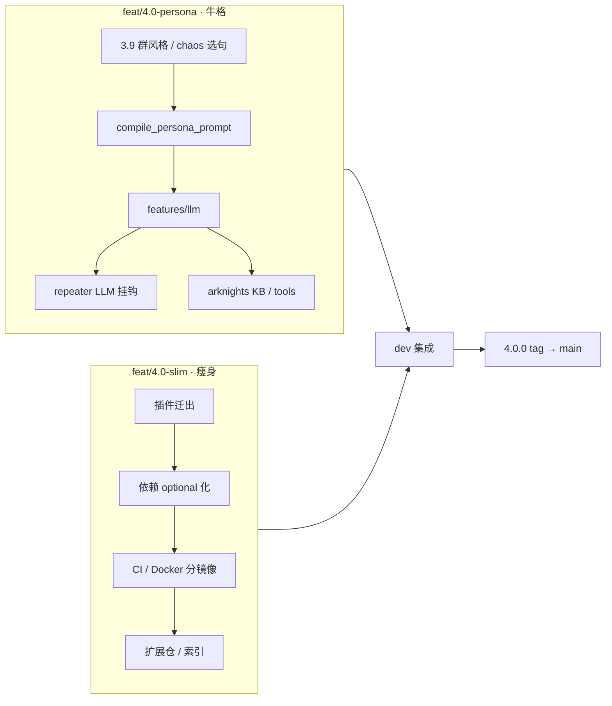

# Pallas-Bot 4.0 路线图

> **4.0 目标**：**牛格**（persona + LLM + 方舟 KB/MCP）与**本体瘦身**（插件分家）两条线并行，在 **`dev`** 集成分支合流发布。本体保留**系统级能力**与**核心复读（含牛格）**；玩法迁入独立插件仓。

## 版本定位

| 版本 | 主题 | 状态 |
| --- | --- | --- |
| 3.x | 分片、ingress、语料联邦 | 当前 `main` 稳定线 |
| **4.0** | **牛格** + **本体瘦身** + 插件分家 | 见 [本体瘦身](pallas-4.0-slim.md) |

4.0 = **发行形态**（瘦身、扩展包）+ **接话智能**（自动 persona、统一 LLM、可选游戏资料 tools）一并交付。

## 双轨开发

| 轨道 | 分支 | 交付概要 |
| --- | --- | --- |
| **牛格** | `feat/4.0-persona` | persona、群风格、LLM 运行时、repeater fallback/polish、方舟 KB/tools、MCP（可选） |
| **本体瘦身** | `feat/4.0-slim` | 玩法插件迁出、依赖/镜像缩小、扩展仓与加载模型 |
| **集成** | `dev` | 两轨合流；**不在此做大功能开发** |

合流与迁移见 [pallas-4.0-slim.md](pallas-4.0-slim.md)、[workflow.md](../develop/workflow.md)。

## 设计参照（发行与分层）

| 参照 | 对齐点 |
| --- | --- |
| [GsUID Core](https://github.com/Genshin-bots/gsuid_core) | 内核 / domain / 插件仓 / 控制台分离 |
| [绪山真寻 Bot](https://github.com/zhenxun-org/zhenxun_bot) | 本体核心 + [独立插件仓](https://github.com/zhenxun-org/zhenxun_bot_plugins) |

Pallas 已有：`local/plugins/`、[site-customization-and-updates.md](site-customization-and-updates.md)、Pallas-Bot-WebUI、`pallas.toml` + WebUI 配置。

## 4.0 本体边界

### 保留在本体

**内核 `features/`（含牛格）**

| 模块 | 4.0 状态 |
| --- | --- |
| `persona` | 行为层 + 群风格（牛格分支持续） |
| `llm` | 4.0 新增：Chat、会话、tool registry |
| `cmd_perm`、`corpus`、`message_scrub` 等 | 系统能力，保留 |

**核心插件**

| 插件 | 说明 |
| --- | --- |
| `repeater` | 核心接话；牛格全部接入点 |
| `help`、`pallas_webui`、`pallas_protocol` | 系统 |
| `request_handler`、`blacklist` | 系统 |
| `platform/ingress/gate`、`platform/ai_callback`、`platform/multi_bot/bot_filter` | 内核（原 ingress_gate / callback / block） |
| `bot_status` | 运维展示（官方扩展 `pallas-plugin-bot-status`） |
| `relogin_*`、`pallas_console_metrics` | 运维 |

**牛格相关（4.0 交付，留本体）**

- [persona-reply-style](persona-reply-style.md) / [group-style-persona](group-style-persona.md)
- [persona-llm-roadmap](persona-llm-roadmap.md) P1–P6（主仓）
- [pallas-ai-service](pallas-ai-service.md)（**Pallas-Bot-AI 仓并行重构**）
- [arknights-knowledge-mcp](arknights-knowledge-mcp.md) K1–K4
- `plugins/ollama`：**legacy 入口**；4.0 新能力走 `features/llm` → AI 仓，非简单收敛

### 迁出本体（瘦身分支）

| 插件 | 扩展包方向 |
| --- | --- |
| `duel`、`who_is_spy`、`dream` | 玩法包 |
| `maa`、`maa_hub` | 远控包 |
| `draw`、`sing`、`chat` | AI 媒体包 |
| `community_stats` | 体验 / 可选 |

**已升格 core（不再迁出）**：`roulette`、`drink`、`greeting`、`take_name`；`connectivity` 已内核化至 `features/service_gateways`。

**仍留本体**：`src/domain/arknights/`（牛格 KB 与扩展 duel 共用）。

## 功能里程碑

| ID | 轨道 | 文档 | 4.0 要求 |
| --- | --- | --- | --- |
| **G1** | 牛格 | [group-style-persona](group-style-persona.md) | 群风格刷新、chaos 选句、LLM 契约导出 |
| **G2** | 牛格 | [persona-llm-roadmap](persona-llm-roadmap.md) + [pallas-ai-service](pallas-ai-service.md) | 主仓 `features/llm` + **AI 仓统一 LLM API 重构**、fallback/polish |
| **G3** | 牛格 | [arknights-knowledge-mcp](arknights-knowledge-mcp.md) | 结构化干员查询 + LLM tools |
| **S1** | 瘦身 | 本文 | 扩展插件迁出仓库默认树 |
| **S2** | 瘦身 | 本文 | 依赖 optional 化、本体 CI |
| **S3** | 瘦身 | 本文 | 官方扩展仓 + 安装/迁移文档 |
| **I1** | 集成 | [pallas-4.0-slim](pallas-4.0-slim.md) | `dev` 合流与迁移文档 |

## 本体瘦身原则

1. 默认 `pyproject` / Docker 镜像不含玩法与重 AI 媒体依赖
2. 4.0 major；迁移指南：原内置 → 扩展包名
3. 扩展包只依赖 documented 的 `features.*` / `domain.*`
4. 本体 CI 只测核心插件；扩展仓独立 CI

## 4.0 验收清单

### 牛格（G1–G3）

- [ ] 无扩展包时 repeater + persona 可运行
- [x] `features/llm` 对接 AI 仓 4.0 API；repeater fallback/polish **骨架**（默认关）可测
- [ ] AI 仓与主仓版本兼容检查（见 [pallas-ai-service](pallas-ai-service.md)）
- [ ] `ollama` legacy 路径文档化；新配置 `llm_*` 迁移说明
- [ ] 干员口令查询与 LLM tool 结果一致
- [ ] WebUI：`group_style_enabled`、LLM 配置可读写

### 瘦身（S1–S3）

- [ ] 本体树不含已迁出插件
- [ ] 至少一个官方扩展包可安装
- [ ] 3.x 升级路径文档完整

### 集成（I1）

- [ ] 分片下 core + extra + local 加载一致
- [ ] `dev` → `main` 全量 CI 绿

## 相关文档

- [pallas-4.0-slim.md](pallas-4.0-slim.md) — 瘦身与迁移
- [persona-llm-roadmap.md](persona-llm-roadmap.md)
- [arknights-knowledge-mcp.md](arknights-knowledge-mcp.md)
- [persona-reply-style.md](persona-reply-style.md)
- [pallas-ai-service.md](pallas-ai-service.md)
- [site-customization-and-updates.md](site-customization-and-updates.md)
