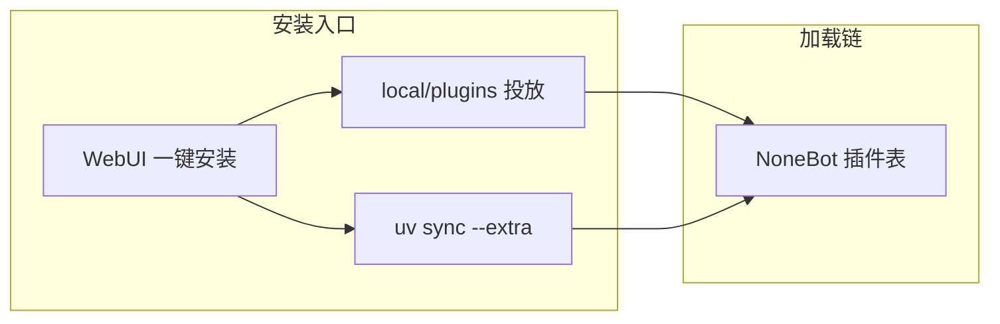
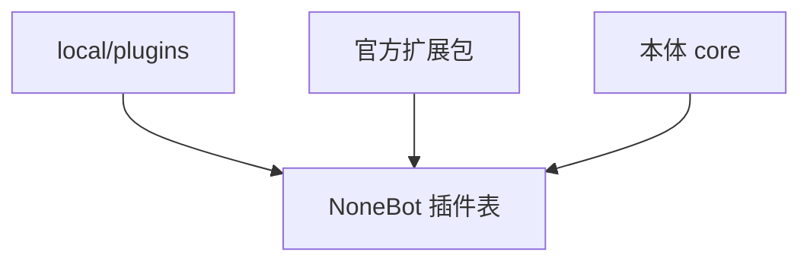

# Pallas-Bot 4.0 · 本体瘦身与插件分家

> **目标版本：4.0** · **开发分支：`feat/4.0-slim`** · 合流目标：**`dev`**  
> 4.0 总览（含牛格轨道）见 [pallas-4.0-roadmap](pallas-4.0-roadmap.md)（`dev` 合流后与本文件同仓维护）。牛格 / LLM / AI 仓 **不在本文范围**。

## 目标

| 做 | 不做 |
| --- | --- |
| 缩小默认安装与 Docker 镜像 | 改动 persona / LLM / repeater 接话逻辑 |
| 玩法与重依赖插件迁出官方扩展包 | 在本分支实现方舟 KB 或 AI 仓 API |
| 明确 core / extra / local 加载与 WebUI 展示 | 一次性拆完所有历史插件（分 PR 迁移） |
| WebUI 一键装扩展 + 真寻式 `local/plugins` 投放并存 | 破坏 `local/plugins` 覆盖能力 |
| 3.x → 4.0 迁移文档与 optional `uv` extras | — |

瘦身完成后：**不装扩展包** 仍可运行系统插件 + **repeater（含牛格）**；缺扩展包时对应命令/help 项明确不可用而非静默失败。

## 设计参照

| 参照 | 对齐点 |
| --- | --- |
| [GsUID Core](https://github.com/Genshin-bots/gsuid_core) | 核心仓 + 插件仓；控制台管配置与插件 |
| [绪山真寻 Bot](https://github.com/zhenxun-org/zhenxun_bot) | 本体仅核心；[独立插件仓库](https://github.com/zhenxun-org/zhenxun_bot_plugins) + 插件索引；**站点直接放本地目录** |
| [Amiya-Bot](https://github.com/AmiyaBot/Amiya-Bot) | 控制台插件商店一键安装（参考交互，非照搬热载框架） |

扩展安装**两条路径并存**（见「扩展安装路径」），不互斥。

Pallas 已有机制（4.0 强化而非重造）：

- [site-customization-and-updates.md](site-customization-and-updates.md) — `local/plugins`、`extra_plugin_dirs`
- [plugin-convention.md](plugin-convention.md) — 插件目录约定
- [bot_process_sharding.md](bot_process_sharding.md) — hub/worker 一致加载
- **[Pallas-Bot-WebUI](https://github.com/PallasBot/Pallas-Bot-WebUI)** — **`feat/4.0`** 分支承接控制台改造

## 扩展安装路径（并存）

| 路径 | 谁用 | 做法 | 落点 |
| --- | --- | --- | --- |
| **真寻式本地投放** | 运维 / 开发者 | 解压或 git clone 到 `local/plugins/<名>/` | `extra_plugin_dirs`，**最高优先级**覆盖同名 core/extra |
| **WebUI 一键安装** | 站点管理员 | 控制台浏览官方索引 → 安装 / 卸载 | 官方包：`uv pip install` 或落到 `local/plugins/`（S6 定稿）；与上表共用加载链 |
| **命令行 extras** | 部署 / CI | `uv sync --extra plugins-duel` 等 | venv pip 包，`pyproject` 声明 |

三条路径**不互斥**：同一插件若同时存在 pip 包与 `local/plugins` 副本，以 **local 为准**（与现网一致）。WebUI 安装失败或未提供商店时，仍可手工投放目录。



**S6（插件商店）** 依赖 S2 扩展仓与 S5 插件 API；索引源为官方扩展清单（版本、包名、兼容本体版本），非任意第三方市场（第三方仍走 local 投放）。

## 本体 vs 扩展边界

### 保留在本体 `src/plugins/`（core）

| 插件 | 类别 |
| --- | --- |
| `repeater` | 核心接话（牛格由 persona 分支交付） |
| `help` | 帮助与插件发现 |
| `pallas_webui` | 控制台 API |
| `ingress_gate` | 入站配套 |
| `bot_status` | 在线与通知 |
| `callback` | 异步回调 |
| `request_handler` | 审批 |
| `blacklist` / `block` | 安全 |
| `connectivity` | 轻量探针 |

### 分片内置（仍在 `src/plugins/`，非用户可选扩展）

| 插件 | 说明 |
| --- | --- |
| `pallas_console_metrics` | worker 指标探针；**计划内核化**至 `platform/shard/`（见下） |
| `ingress_gate` | worker 入站（亦在 core 默认加载） |
| `relogin_forward` / `maa_hub` | 分片角色专用；随对应官方扩展 pip 包分发 |

### 迁出本体（官方扩展包）

| 当前插件 | 建议包名 | 依赖特征 | 优先级 |
| --- | --- | --- | --- |
| `pallas_protocol` / `relogin_bot` / `relogin_forward` | `pallas-plugin-protocol` | 协议端 + 重登；三者同包 | P0 |
| `duel` | `pallas-plugin-duel` | 玩法 + `domain/arknights` | P0 |
| `who_is_spy` | `pallas-plugin-who-is-spy` | 玩法 + 协调存储 | P0 |
| `maa` / `maa_hub` | `pallas-plugin-maa` | 远控、HTTP | P0 |
| `roulette` / `drink` | `pallas-plugin-party` 或拆分 | 轻玩法 | P1 |
| `dream` | `pallas-plugin-dream` | repeater 旁路 | P1 |
| `draw` | `pallas-plugin-draw` | 图像 API | P1 |
| `sing` / `chat` | `pallas-plugin-ai-media` | AI 仓媒体 | P1 |
| `greeting` / `take_name` | `pallas-plugin-social` | 体验 | P2 |
| `community_stats` | 扩展或保留 core | 上报；产品决策 | P2 |

**留内核、不随插件迁出**：`src/domain/arknights/`、`src/features/*` 公开 API、分片与 ingress。

### 分片指标内核化（架构路线）

`pallas_console_metrics` 当前是 **worker 上的薄插件**，仅为了在「不加载 `pallas_webui`」时挂指标钩子。目标形态：

1. 指标采集与刷盘迁入 `src/console/metrics/` 或 `src/platform/shard/worker_metrics.py`
2. `bot_worker` / `plugin_loader` 在 worker 角色显式启动，**删除** `src/plugins/pallas_console_metrics/`
3. hub / unified 仍由 `pallas_webui` 聚合展示

未装 **`pallas-plugin-protocol`** 时：控制台 API 的 `protocol_extension.installed=false`；WebUI 协议页提示 `uv sync --extra plugins-protocol`（与插件是否 bundled 在仓库无关）。

### 加载优先级



1. `local/plugins` 同名 override 扩展与 core
2. 扩展包 `pyproject` 依赖 `pallas-bot`
3. core 仅在本体 `src/plugins/` 维护

实现触点：`read_bootstrap_extra_plugin_dirs()`、`src/platform/bot_runtime/plugin_loader.py`、`help` 插件列表来源标注。

## 依赖与安装面（S2）

### optional extras（目标）

```toml
[project.optional-dependencies]
plugins-duel = ["pallas-plugin-duel>=4.0"]
plugins-maa = ["pallas-plugin-maa>=4.0"]
plugins-game = ["pallas-plugin-duel", "pallas-plugin-who-is-spy"]
deploy-full = ["pallas-bot[plugins-game,plugins-maa,...]"]
```

默认 `uv sync` 仅 core 依赖；全功能部署用 `--extra deploy-full`。

## Docker 与 CI（S3）

| 项 | 4.0 目标 |
| --- | --- |
| 默认镜像 | core + repeater；体积较 3.x 减小 |
| compose profile | 预装常用扩展 |
| 本体 CI | 仅 core 插件测试 |
| 扩展仓 CI | 独立；可选 nightly 对 `dev` e2e |

分片：hub/worker 相同 extras / `extra_plugin_dirs`。

## WebUI 协同（`feat/4.0`）

| 项 | 说明 |
| --- | --- |
| 插件列表 | 展示 core / extra / local / pip 来源 |
| 扩展说明 | 推荐 extras、迁移对照表 |
| 主仓 API | `pallas_webui` 返回 `source`、`extra_package` |
| **插件商店（S6）** | 浏览官方索引、一键安装/卸载；与 `local/plugins` 手工投放并存 |

## 实施阶段

| 阶段 | 交付 |
| --- | --- |
| **S1** | 本文 + 矩阵冻结；扩展仓模板 | 已交付 |
| **S2** | duel/maa 等首包迁出 |
| **S3** | pyproject extras | 已交付（占位 extras + 包名映射） |
| **S4** | Docker / CI 分轨 |
| **S5** | 迁移文档 + WebUI 插件列表 API | 已交付（`GET …/plugins/official-extensions`） |
| **S6** | WebUI 插件商店：官方索引、一键安装/卸载；与 local 投放并存 |

## 3.x → 4.0 迁移（摘要）

1. 升级本体 4.0.0  
2. 按对照表 `uv sync --extra …`，或 WebUI 商店一键安装（S6），或继续 `local/plugins` 投放  
3. `local/plugins` 不变，且覆盖 pip / 官方扩展同名插件  
4. 分片各 worker 相同扩展集  
5. 未装扩展：help 不展示；触发时提示安装扩展包或打开 WebUI 商店  

## 验收清单

- [ ] 默认 `uv sync` 后仅 core 插件树
- [ ] `--extra plugins-duel` 后 duel 可用
- [ ] 未装扩展时 help/命令行为符合文档
- [ ] 分片 hub/worker 扩展一致
- [ ] 默认 Docker 镜像无迁出插件代码
- [ ] WebUI feat/4.0 可展示插件 source（或 API 就绪）
- [ ] WebUI 可浏览官方扩展索引并一键安装（S6）
- [ ] 一键安装与 `local/plugins` 手工投放可并存且 local 优先
- [ ] 迁移文档完整

## 相关文档

- [4.0-development.md](../develop/4.0-development.md) — 分支约定与 `load_bundled_extra_plugins`
- [site-customization-and-updates.md](site-customization-and-updates.md)
- [plugin-convention.md](plugin-convention.md)
- [bot_process_sharding.md](bot_process_sharding.md)
