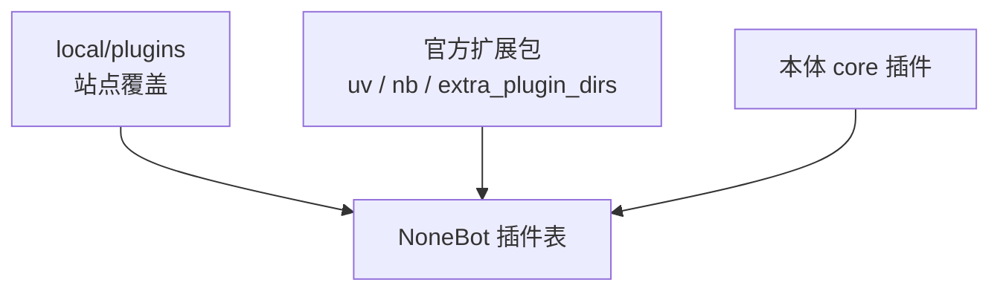
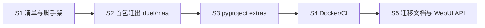

# Pallas-Bot 4.0 · 本体瘦身与插件分家

> **目标版本：4.0** · **开发分支：`feat/4.0-slim`** · 合流目标：**`dev`**  
> 总览与牛格轨道见 [pallas-4.0-roadmap](pallas-4.0-roadmap.md)（集成后与本文件同仓维护）。牛格 / LLM / AI 仓 **不在本文范围**。

## 目标

| 做 | 不做 |
| --- | --- |
| 缩小默认安装与 Docker 镜像 | 改动 persona / LLM / repeater 接话逻辑 |
| 玩法与重依赖插件迁出官方扩展包 | 在本分支实现方舟 KB 或 AI 仓 API |
| 明确 core / extra / local 加载与 WebUI 展示 | 一次性拆完所有历史插件（分 PR 迁移） |
| 3.x → 4.0 迁移文档与 optional `uv` extras | 破坏 `local/plugins` 覆盖能力 |

瘦身完成后：**不装扩展包** 仍可运行系统插件 + **repeater（含牛格）**；缺扩展包时对应命令/help 项明确不可用而非静默失败。

## 设计参照

| 参照 | 对齐点 |
| --- | --- |
| [GsUID Core](https://github.com/Genshin-bots/gsuid_core) | 核心仓 + 插件仓；控制台管配置与插件 |
| [绪山真寻 Bot](https://github.com/zhenxun-org/zhenxun_bot) | 本体仅核心；[独立插件仓库](https://github.com/zhenxun-org/zhenxun_bot_plugins) + 插件索引 |

Pallas 已有机制（4.0 强化而非重造）：

- [site-customization-and-updates.md](site-customization-and-updates.md) — `local/plugins`、`extra_plugin_dirs`
- [plugin-convention.md](plugin-convention.md) — 插件目录约定
- [bot_process_sharding.md](bot_process_sharding.md) — hub/worker 一致加载
- **Pallas-Bot-WebUI** — `feat/4.0` 分支承接控制台侧改造（插件列表、扩展安装说明）

## 本体 vs 扩展边界

### 保留在本体 `src/plugins/`（core）

| 插件 | 类别 |
| --- | --- |
| `repeater` | 核心接话（含牛格，由 persona 分支交付） |
| `help` | 帮助与插件发现 |
| `pallas_webui` | 控制台 API |
| `pallas_protocol` | 协议端管理 |
| `ingress_gate` | 入站配套 |
| `bot_status` | 在线与通知 |
| `callback` | 异步回调 |
| `request_handler` | 审批 |
| `blacklist` / `block` | 安全 |
| `pallas_console_metrics` | 指标 |
| `relogin_bot` / `relogin_forward` | 账号运维 |
| `connectivity` | 轻量探针（若依赖仍轻；否则降为扩展） |

### 迁出本体（官方扩展包）

| 当前插件 | 建议包名 | 依赖特征 | 优先级 |
| --- | --- | --- | --- |
| `duel` | `pallas-plugin-duel` | 玩法 + `domain/arknights` 消费 | P0 |
| `who_is_spy` | `pallas-plugin-who-is-spy` | 玩法 + 协调存储 | P0 |
| `roulette` / `drink` | `pallas-plugin-party` 或拆分 | 轻玩法 | P1 |
| `dream` | `pallas-plugin-dream` | repeater 旁路 | P1 |
| `maa` / `maa_hub` | `pallas-plugin-maa` | 远控、HTTP | P0 |
| `draw` | `pallas-plugin-draw` | 图像 API、重 HTTP | P1 |
| `sing` / `chat` | `pallas-plugin-ai-media` | AI 仓 RWKV/媒体 | P1 |
| `greeting` / `take_name` | `pallas-plugin-social` | 体验 | P2 |
| `community_stats` | `pallas-plugin-community-stats` 或保留 core | 上报；默认开需产品决策 | P2 |

**留内核、不随插件迁出**：`src/domain/arknights/`、`src/features/*` 公开 API、分片与 ingress。

### 加载优先级



1. `local/plugins` 同名 **override** 扩展包与 core（现有语义不变）
2. 扩展包通过 `pyproject` 依赖 `pallas-bot`，声明 entry point 或目录路径
3. core 插件仅在本体仓库 `src/plugins/` 维护

实现触点（瘦身 PR 逐改）：

- `read_bootstrap_extra_plugin_dirs()`、`plugin_loader` / NoneBot `plugin_dirs`
- `help` 插件列表：标注 `source: core | extra | local`
- 分片：hub 与 worker **同一**扩展包列表（配置同步或共享 compose 卷）

## 依赖与安装面（S2）

### `pyproject.toml` optional extras（目标形态）

```toml
[project.optional-dependencies]
plugins-duel = ["pallas-plugin-duel>=4.0"]
plugins-maa = ["pallas-plugin-maa>=4.0"]
plugins-game = ["pallas-plugin-duel", "pallas-plugin-who-is-spy", "..."]
plugins-ai-media = ["pallas-plugin-draw", "..."]
deploy-full = ["pallas-bot[plugins-game,plugins-maa,plugins-ai-media]"]
```

- **默认** `uv sync`：仅 core 依赖（去掉玩法专用重型包）
- 文档与 Compose：`uv sync --extra deploy-full` 等价于当前「全功能」部署

### 需从 core 默认依赖剥离的类别（盘点时逐条确认）

- 玩法专用、仅单插件使用的库
- `draw` / `sing` 专用 HTTP 或媒体栈（若与 core 无交叠）
- 扩展包独占的可选 extra（如 MAA 客户端库）

**保留在 core**：DB、ingress、PillowMD（help）、apscheduler、cmd_perm 共用栈。

## Docker 与 CI（S3）

| 镜像 / 流水线 | 4.0 目标 |
| --- | --- |
| `pallas-bot` 默认镜像 | core + repeater + webui API；体积较 3.x 明显减小 |
| `pallas-bot-full` 或 compose profile | 预装常用扩展包 |
| 本体 CI | `tests/` 仅 core 插件；迁出插件目录的测试随扩展仓 |
| 扩展仓 CI | 独立 pytest；可选 nightly 对 `dev` 集成分支跑 compose e2e |

分片 compose：hub/worker 挂载 **相同** `extra_plugin_dirs` 或相同 venv extras。

## WebUI（Pallas-Bot-WebUI · `feat/4.0`）

与主仓瘦身 **并行**；Console 仍调主仓 API，UI 改造在 WebUI 仓：

| 项 | 说明 |
| --- | --- |
| 插件列表 | 展示 core / extra / local 来源、版本、是否已安装 |
| 扩展安装 | 文档链或「推荐 extras」说明（首版可静态，后续接索引） |
| 帮助 / 禁用插件 | 未安装的扩展不在帮助总览出现（与现有 `*_enable` 一致） |
| 4.0 迁移页 | 3.x 内置插件 → 扩展包名对照表 |

主仓 `pallas_webui` API 瘦身分支需补充：已加载插件 metadata 含 `source` 字段（供 WebUI 消费）。

## 实施阶段（feat/4.0-slim）



| 阶段 | 交付 | 可合并 dev |
| --- | --- | --- |
| **S1** | 本文 + 插件矩阵冻结；扩展仓空壳 `pallas-plugin-template` | 文档 only |
| **S2** | 1–2 个插件物理迁出；本体树删除对应目录；扩展仓可安装 | 与 persona 无冲突时 |
| **S3** | optional extras；默认 `uv sync` 体积下降 | 是 |
| **S4** | 分镜像 / CI 拆分 | 是 |
| **S5** | [Deployment](../Deployment.md) 迁移章节；WebUI `source` API | 依赖 WebUI feat/4.0 |

## 3.x → 4.0 迁移（用户向摘要）

1. 升级本体到 4.0.0
2. 对照表安装曾用的扩展包：`uv sync --extra plugins-game` 或 compose profile
3. 站点 `local/plugins` **无需改动**（仍最高优先级）
4. 分片：所有 worker 安装相同 extras
5. 未安装的扩展：帮助不展示；触发时返回「未安装 xxx 扩展」提示

## 架构约束

1. **不删 public API**：扩展包只用 documented 的 `features.*` / `domain.*` / `platform.*`
2. **不拆 repeater / persona / llm**：属 core + persona 分支
3. **breaking 仅 4.0 major**：扩展包 semver 随 4.0 起 `>=4.0`
4. **同名 override**：local > extra > core，行为与现网一致
5. **与牛格合流**：`dev` 上冲突以「core 边界」为准；persona 不改插件迁出列表

## 验收清单（瘦身轨道）

- [ ] 默认 clone + `uv sync` 后仅有 core 插件目录
- [ ] `uv sync --extra plugins-duel` 后 duel 命令可用
- [ ] 未装扩展时 help 与命令行为符合文档
- [ ] 分片 hub/worker 扩展列表一致
- [ ] Docker 默认镜像不含已迁出插件代码
- [ ] WebUI feat/4.0 可展示插件 source（或 API 就绪）
- [ ] 3.x → 4.0 迁移文档完整

## 相关文档

- [pallas-4.0-roadmap.md](pallas-4.0-roadmap.md) — 4.0 总览（合流后）
- [4.0-development.md](../develop/4.0-development.md) — 分支与 dev 合流
- [site-customization-and-updates.md](site-customization-and-updates.md)
- [plugin-convention.md](plugin-convention.md)
- [bot_process_sharding.md](bot_process_sharding.md)
