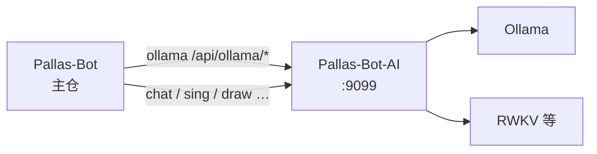
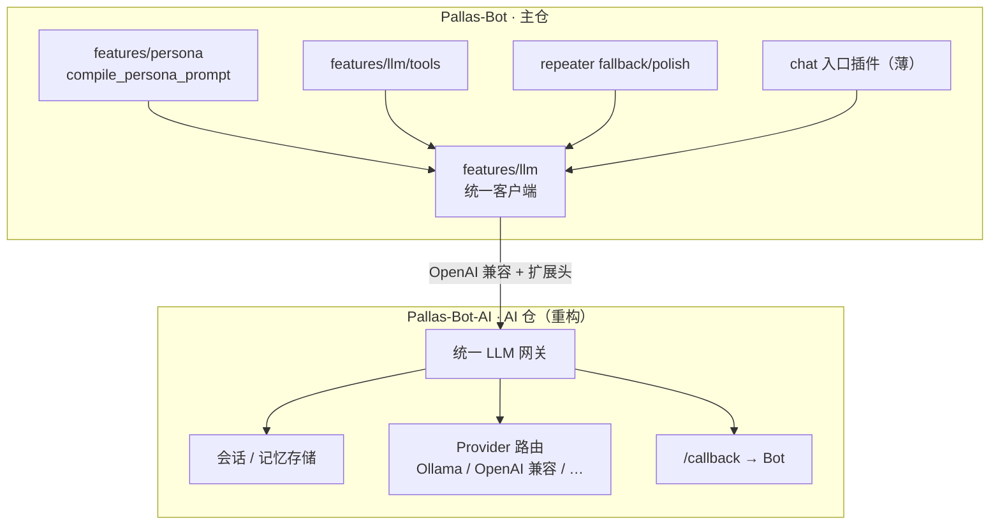
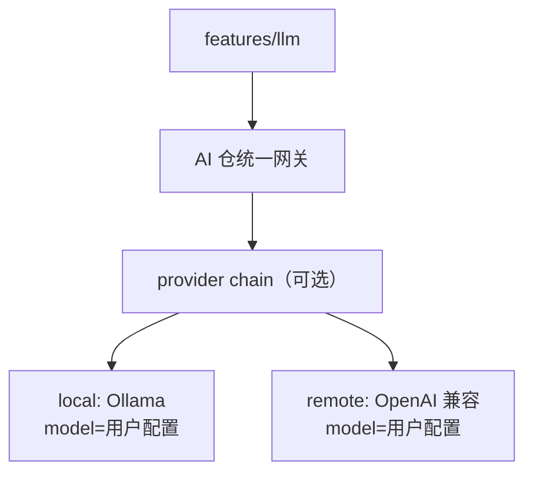

# Pallas-Bot ↔ Pallas-Bot-AI 协同（4.0）

> **目标版本：4.0**。LLM 能力**以 [Pallas-Bot-AI](https://github.com/PallasBot/Pallas-Bot-AI) 为运行时**；主仓负责 persona、路由、工具与业务插件，AI 仓负责模型、推理与会话基础设施。**两仓 4.0 需并行演进**，版本与 API 契约对齐。

## 现状



| 主仓消费方 | 典型路径 | 说明 |
| --- | --- | --- |
| `plugins/llm_chat` | `/api/v1/chat/completions`、会话删除、模型热更换 | 随时 @ 多轮闲聊 |
| `plugins/chat` | 同上（`mode=drunk`） | 酒后聊天 |
| `plugins/repeater` | 同上（fallback / polish 异步） | 语料 miss / 轻改写，默认关 |
| `plugins/sing` | AI 仓唱歌接口 | |
| `plugins/draw` | 图像生成 API | 可走 AI 仓或独立网关 |
| `pallas_webui` | 日志目录、健康探测 | 默认同级 `../Pallas-Bot-AI` |
| 分片 hub | `ai_callback_forward` | AI 回调转发 worker |

配置：`AI_SERVER_HOST` / `AI_SERVER_PORT`（默认 `127.0.0.1:9099`），见 [persona-llm-roadmap · 全局 LLM 配置](persona-llm-roadmap.md#全局-llm-配置键主仓) 与各插件文档。

**问题（4.0 前）**：按能力分散的 HTTP 路径；会话与 prompt 策略在主仓各插件重复；**无统一 Chat Completions / tool call** 供 repeater fallback 与方舟 KB 共用。

## 4.0 目标形态



### 职责切分

| 层 | Pallas-Bot（主仓） | Pallas-Bot-AI（AI 仓） |
| --- | --- | --- |
| 人设与群风格 | `compile_persona_prompt`、`compile_group_style_*` | 接收 `system` / metadata，**不**维护业务 persona 逻辑 |
| 业务工具 | tool schema、handler、`domain/arknights` 查询 | 可选：转发 tool 结果；或 Bot 侧执行后回填 |
| 会话键 | `(bot_id, group_id, user_id)` 等业务 id | 存储、窗口、TTL、embedding（若启用） |
| 模型与算力 | WebUI 展示、调用配额策略 | 模型列表、拉取、卸载、GPU、provider 配置 |
| 接话 LLM | repeater 触发条件、fallback/polish 开关 | 执行 completion 请求 |
| ingress / 分片 | claim、fanout、CD | 无业务 ingress；回调走 hub 转发 |

### 对 `llm_chat` 插件的定位（4.0）

**不是**「薄包装收敛」为止，而是：

1. **主路径**：`features/llm` → AI 仓**统一 Chat API**（`/api/v1/chat/completions`）
2. **`plugins/llm_chat`**：随时 @ 入口；酒后 `chat` 共用同一客户端
3. **AI 仓**：legacy `/api/ollama/*` 兼容期保留；新能力走统一 API
4. **repeater**：`fallback.py` / `polish.py` 异步提交；callback `task_type=repeater_fallback` 失败静默、`repeater_polish` 失败回退原句

`chat` / `sing` / `draw` 仍可在 **瘦身分支**迁扩展包，但其 AI 调用也应逐步改用 AI 仓统一网关或专用子路由，避免主仓直连多套 URL 约定。

## AI 仓 4.0 重构要点（与主仓对齐）

与主仓 [persona-llm-roadmap](persona-llm-roadmap.md) **P2–P4** 同步交付：

| 项 | AI 仓交付 | 主仓消费 |
| --- | --- | --- |
| **A1** 统一 Chat API | OpenAI 兼容 `POST /v1/chat/completions`（或 `/api/llm/chat`） | `features/llm.chat_complete()` |
| **A2** 会话 | `session_id` 创建/续聊/清除；与 Bot 业务 id 映射 | P3 会话存储或委托 AI 仓 |
| **A3** system / metadata | 接受 Bot 下发的 `system`、persona 版本、群 id | `compile_persona_prompt` 输出 |
| **A4** tool call | 请求带 tools；响应 `tool_calls`；Bot 执行后 submit 结果 | P9 + 方舟 KB |
| **A5** 健康与版本 | `GET /health` 含 API 版本、支持的 features | WebUI 连通性、4.0 兼容检查 |
| **A6** 配置 | provider、模型、并发、超时；与 Bot WebUI 分工（Bot 显式开关，AI 仓管模型） | `pallas.toml` / WebUI `llm_*` |
| **A7** 回调 | 异步任务仍走 `/callback`；分片 hub 转发不变 | 现有 `ai_callback_forward` |

Legacy `/api/ollama/*`：**4.0 不删**则文档标 deprecated；新功能禁止再增 ollama 专用路径。

## Provider：本地 / 远端 / 备线

4.0 LLM **必须同时支持**本地与远端；主仓 `features/llm` 只认 AI 仓统一 API。**产品不绑定具体模型名**——各站点按算力与预算在 WebUI / AI 仓配置里自行选择。

### 设计原则

| 做 | 不做 |
| --- | --- |
| 统一 Chat Completions 契约、会话、tool call 扩展 | 在代码或 compose 里写死 `qwen3:14b` 等「官方推荐模型」 |
| **local** 适配 **Ollama**（OpenAI 兼容 `/v1`） | 为主流每个模型族单独写插件（Hermes、Qwen、DeepSeek 等都只是 Ollama **model 字符串**） |
| **remote** 适配 **OpenAI 兼容** HTTPS | 主仓保存各家 `api_key` |
| WebUI 展示：provider 模式、当前 model、连通性 | 替用户决定 local 优先还是 remote 优先 |

**本地就用 Ollama 作为唯一一等公民适配器**即可：用户 `ollama pull` 什么 tag，配置里填什么——包括 Qwen3、Qwen2.5、Gemma、Llama、**Hermes**、**DeepSeek-R1 distill**、MoE 小激活等。Pallas 只转发 `model` 字段与 `think` 等扩展参数，不维护模型排行榜。

### 类型与职责

| 类型 | 典型实现 | 配置落点 | 说明 |
| --- | --- | --- | --- |
| **local** | **Ollama**（首选）；可选 vLLM / llama.cpp server | AI 仓 `.env` / compose | 模型名 = 用户自选的 Ollama tag |
| **remote** | OpenAI 兼容（DashScope、DeepSeek、SiliconFlow、自建等） | AI 仓 `.env` | 模型名 = 服务商 API 的 `model` id |
| **chain** | 有序 provider + 失败策略 | 可选；**默认关闭** | 仅当用户显式配置「local 失败再 remote」等 |



### 路由原则

1. **provider 模式由用户选**：`local_only` | `remote_only` | `chain`（chain 需显式开启）。
2. **model 由用户选**：local 填 Ollama tag（如 `hermes3:8b`、`qwen3:8b`、`deepseek-r1:8b`）；remote 填 API model id。
3. **密钥与 base_url 仅在 AI 仓**；主仓 WebUI 可改 model / 模式，不存 remote 密钥（或只读展示是否已配置）。
4. **会话与 provider 解耦**：`session_id`、Bot 下发的 `system` / metadata 不因换 model 而丢；failover 是否允许换 model 可配置。

### 配置示意（AI 仓侧）

```yaml
llm:
  mode: local_only              # local_only | remote_only | chain
  local:
    type: ollama
    base_url: http://127.0.0.1:11434
    model: ${OLLAMA_MODEL}      # 用户填写，示例见 Deployment，非产品默认
    think: false                # 接话/闲聊 preset，用户可改
  remote:
    type: openai_compatible
    base_url: ${LLM_REMOTE_BASE_URL}
    api_key: ${LLM_REMOTE_API_KEY}
    model: ${LLM_REMOTE_MODEL}
  chain:                          # 仅 mode=chain 时生效
    order: [local, remote]
    on_failure: try_next
```

**Deployment 文档**可附「显存 vs 模型体量」对照表（示例：`qwen3:0.6b` / `4b` 省 VRAM、distill 系、Hermes 等），标注为 **示例而非默认**。

### 与本仓已有模式对齐

| 模式 | 本仓参考 | 4.0 用法 |
| --- | --- | --- |
| 多 provider 顺序 | `message_scrub/api_chain.py` | AI 仓 gateway 内 chain |
| 主 + 备网关 | `draw` 的 `pallas_image_api_backends` | `default_chain` 第二项起 |
| 远端失败策略 | 语料 `on_remote_failure` | `on_failure: local_only` 等 |

### Legacy 能力映射

| 现状 | 4.0 provider 策略 |
| --- | --- |
| `/api/ollama/*` | 归入 `local_ollama`；路径 deprecated，行为由统一 Chat API 代理 |
| RWKV `chat`（酒后聊天） | **deprecated**（2026）；改统一 LLM + `compile_persona_prompt`（见 [AI 仓 2026 评估](https://github.com/PallasBot/Pallas-Bot-AI/blob/feat/4.0/docs/architecture/4.0-local-models.md)） |
| TTS / sing | 非 Chat provider；**CosyVoice 3 / RVC + Seed-VC**（2026 media 路线），见 AI 仓评估文档 |

主仓 repeater fallback/polish、闲聊、工具调用 **共用**上述 Chat provider chain；TTS/sing 继续走 Celery 异步与 `/callback`，不占用 Chat provider 队列。

## 版本与联调

| 发布 | 主仓 | AI 仓 |
| --- | --- | --- |
| 4.0.0 | `features/llm`、repeater fallback、牛格 prompt | 统一 LLM 网关 + 会话 A1–A3 最低集 |
| 4.0.x | tool call、方舟 KB tools | A4 完善 |
| 4.1+ | MCP Server（可选） | embedding 长期记忆（可选） |

**联调约定**：

- 开发期两仓同级目录：`../Pallas-Bot-AI`（与 WebUI 日志路径一致）
- CI：主仓 mock AI HTTP；AI 仓独立单测；可选 nightly 双仓 compose
- `feat/4.0-persona` 分支上主仓 PR 若依赖新 API，**同周期**提 AI 仓 PR 或在 PR 描述写最低 AI 仓 tag/commit

## 配置迁移（4.0 方向）

| 现键（插件级 / 遗留） | 4.0 方向 |
| --- | --- |
| `ai_server_host` / `ai_server_port` | 全局 `AI_SERVER_HOST` / `AI_SERVER_PORT` |
| `chat_enable` / `llm_chat_enable` / `ollama_enable` | **`LLM_CHAT_ENABLED` 总闸**（酒后与随时 @ 共用） |
| `LLM_FALLBACK_ENABLED` / `LLM_POLISH_ENABLED` | repeater 接话 LLM（默认关） |
| `ollama_*_endpoint` | 删除；改 `/api/v1/chat/completions` |
| `llm_chat_system_prompt_path` | 可选 override；默认 `compile_persona_prompt` |

落盘仍遵循 [settings-storage](settings-storage.md)；AI 仓侧模型/provider 仍在 AI 仓 `.env` / compose。

## 验收（跨仓）

- [ ] 主仓 `features/llm` 对 AI 仓 mock 与真实 4.0 API 单测通过
- [x] `@牛牛` 闲聊经统一 Chat API，persona system 来自 `compile_persona_prompt`
- [ ] repeater fallback（开）与 polish（开）联调；失败回退行为与文档一致
- [ ] AI 仓 `/health` 暴露版本；主仓启动日志提示不兼容 AI 仓版本
- [ ] 分片：AI 回调与 LLM 同步调用在 worker 行为一致
- [ ] 文档：Deployment 双仓 4.0 最低版本表

## 相关文档

- [pallas-4.0-roadmap.md](pallas-4.0-roadmap.md)
- [persona-llm-roadmap.md](persona-llm-roadmap.md)
- [4.0-development.md](../develop/4.0-development.md)
- [plugins/ollama](../plugins/ollama/README.md)（现状）
- [Pallas-Bot-AI Deployment](https://github.com/PallasBot/Pallas-Bot-AI/blob/main/docs/Deployment.md)
- [Pallas-Bot-AI · 4.0 本地模型栈评估（2026-06 基准）](https://github.com/PallasBot/Pallas-Bot-AI/blob/feat/4.0/docs/architecture/4.0-local-models.md)
