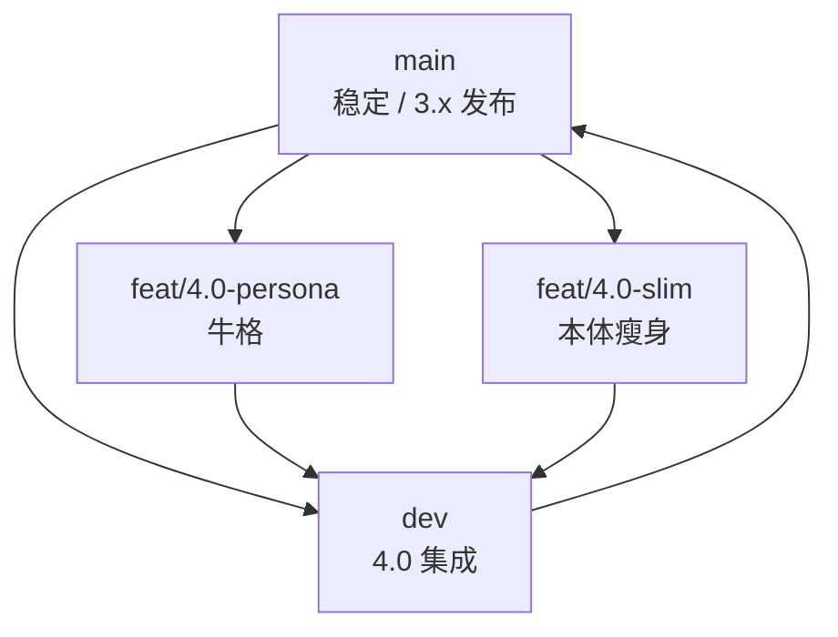

# 4.0 并行开发 · 分支约定

> 总览见 [pallas-4.0-roadmap.md](../architecture/pallas-4.0-roadmap.md)。**4.0** 含两条并行轨道：**牛格**与**本体瘦身**；集成分支为 **`dev`**。瘦身细则见 [pallas-4.0-slim.md](../architecture/pallas-4.0-slim.md)。

## 分支模型



| 分支 | 用途 | 典型改动 |
| --- | --- | --- |
| `main` | 3.x 稳定线；hotfix 仍先进 `main` 或 cherry-pick | 与 4.0 无关的修复 |
| **`dev`** | **4.0 纯集成**：只合并两条子分支，不在此做大功能开发 | merge `feat/4.0-persona`、`feat/4.0-slim` |
| `feat/4.0-persona` | **牛格**全栈（见下表） | persona、LLM、KB/MCP、repeater 挂钩 |
| `feat/4.0-slim` | **本体瘦身** | 插件迁出、依赖拆分、CI/镜像、扩展仓脚手架 |
| Pallas-Bot-WebUI `feat/4.0` | 控制台 4.0 | 插件来源、官方扩展商店 |

### `feat/4.0-persona`（牛格）范围

4.0 牛格 **不是**仅 3.9 群风格，而是整条接话智能线，至 4.0 发布前交付：

| 模块 | 文档 |
| --- | --- |
| 行为层 + 群风格（已部分落地） | [persona-reply-style](../architecture/persona-reply-style.md)、[group-style-persona](../architecture/group-style-persona.md) |
| LLM 语言层 + repeater fallback/polish | [persona-llm-roadmap](../architecture/persona-llm-roadmap.md)、[pallas-ai-service](../architecture/pallas-ai-service.md) |
| 明日方舟 KB / tools / MCP | [arknights-knowledge-mcp](../architecture/arknights-knowledge-mcp.md) |
| `features/persona`、`features/llm` | 主仓内核；**推理在 Pallas-Bot-AI** |
| `plugins/llm_chat` | 随时 @ 入口；4.0 经 `features/llm` 调 AI 仓统一 API |

**跨仓**：`feat/4.0-persona` 时期，主仓 PR 若依赖新 LLM API，须 **同周期** 在 [Pallas-Bot-AI](https://github.com/PallasBot/Pallas-Bot-AI) 提对应重构（或 PR 注明最低 AI 仓 tag）。见 [pallas-ai-service](../architecture/pallas-ai-service.md)。

**不在牛格分支**：玩法插件目录迁移、optional 依赖瘦身（属 `feat/4.0-slim`）。

### `feat/4.0-slim`（本体瘦身）范围

| 模块 | 说明 |
| --- | --- |
| 插件迁出清单 | duel / dream / maa / draw 等 → 扩展仓或 optional extra |
| `pyproject.toml` | 默认依赖缩小 |
| Docker / CI | 本体镜像与扩展包分构建 |
| 加载与 WebUI | 插件来源（core / extra / local）展示 |
| 迁移文档 | 3.x → 4.0 扩展包安装说明 |

**不在瘦身分支**：persona 算法、LLM prompt、群风格统计（属 `feat/4.0-persona`）。

## 扩展安装（瘦身合流后）

- **命令行**：`uv sync --extra plugins-duel` 等（官方扩展均已指向 Git 仓，见下表）；组合包 `plugins-game`、`deploy-full`、`deploy-all`
- **WebUI 一键安装**：`./scripts/pallas ext install … --restart` 或商店「安装并重启」
- **Bot 本体更新**：`./scripts/pallas update bot --restart` 或更新页「更新并重启」
- **组合维护**：`./scripts/pallas maintenance run --update-bot`（可选 `--sync-extra deploy-full`）
- **站点定制目录**：见 [站点定制](../architecture/site-customization-and-updates.md)

`GET /pallas/api/.../plugins/official-extensions` 与 install/uninstall 供 WebUI 使用；`restart=true` 时经 `pallas restart` 编排。

## 配置

```toml
[bootstrap]
# load_bundled_extra_plugins = false   # 4.0 默认，仅 core
# load_bundled_extra_plugins = true    # 迁移期加载 bundled extra
```

或 `PALLAS_LOAD_BUNDLED_EXTRA=1`。

## 本地开发

```bash
uv run nb run                                    # 仅 core
PALLAS_LOAD_BUNDLED_EXTRA=1 uv run nb run         # 含本体 bundled extra（迁移期）
uv sync --extra plugins-duel                      # 从独立仓安装决斗扩展
```

与扩展仓 sibling 联调时，可在 `pyproject.toml` 的 `[tool.uv.sources]` 将对应包改为 `{ path = "../Pallas-Plugin-Duel" }` 后 `uv sync`。

## 官方扩展仓

| pip 包 | 插件 | 仓库 |
| --- | --- | --- |
| `pallas-plugin-protocol` | pallas_protocol、relogin_bot、relogin_forward | [TogetsuDo/pallas-plugin-protocol](https://github.com/TogetsuDo/pallas-plugin-protocol) |
| `pallas-plugin-duel` | duel | [TogetsuDo/pallas-plugin-duel](https://github.com/TogetsuDo/pallas-plugin-duel) |
| `pallas-plugin-maa` | maa、maa_hub | [TogetsuDo/pallas-plugin-maa](https://github.com/TogetsuDo/pallas-plugin-maa) |
| `pallas-plugin-who-is-spy` | who_is_spy | [TogetsuDo/pallas-plugin-who-is-spy](https://github.com/TogetsuDo/pallas-plugin-who-is-spy) |
| `pallas-plugin-dream` | dream | [TogetsuDo/pallas-plugin-dream](https://github.com/TogetsuDo/pallas-plugin-dream) |
| `pallas-plugin-draw` | draw | [TogetsuDo/pallas-plugin-draw](https://github.com/TogetsuDo/pallas-plugin-draw) |
| `pallas-plugin-ai-media` | sing、chat | [TogetsuDo/pallas-plugin-ai-media](https://github.com/TogetsuDo/pallas-plugin-ai-media) |
| `pallas-plugin-community-stats` | community_stats | [TogetsuDo/pallas-plugin-community-stats](https://github.com/TogetsuDo/pallas-plugin-community-stats) |
| `pallas-plugin-llm-chat` | llm_chat | [TogetsuDo/pallas-plugin-llm-chat](https://github.com/TogetsuDo/pallas-plugin-llm-chat) |

未装 `plugins-protocol` 时：`GET …/instances` 返回 `protocol_extension.installed=false`；WebUI 协议页展示安装指引。

全官方扩展：`uv sync --extra deploy-all`（`deploy-full` 为协议+核心玩法常用组合）。

生成/刷新扩展仓源码：`uv run python tools/bootstrap_extension_repos.py`。

## plugin_coord（S2）

内核与分片经 `src/features/plugin_coord/` 调用 duel / maa / dream 能力；未安装扩展时安全 no-op。

| 桥接 | 消费者 |
| --- | --- |
| `plugin_coord.duel` | `duel_group` / `duel_qte`、repeater、block、greeting |
| `plugin_coord.maa` | `maa_pending_registry` / `maa_seen_registry` / `maa_hub_routes` |
| `plugin_coord.dream` | `dream_drift` |

## 日常流程

### 在子分支开发

```bash
git checkout feat/4.0-persona   # 或 feat/4.0-slim
uv run ruff check src/ && uv run pytest
```

### 合入 dev（集成）

```bash
git checkout dev
git merge feat/4.0-persona   # 或通过 PR
uv run ruff check src/ && uv run pytest
```

### 4.0 发布

`dev` 验收通过后 **`dev` → `main`**，打 **4.0.0** tag。

## 与 3.x 的关系

- `feat/persona-reply-style` 已重命名为 **`feat/4.0-persona`**
- 3.x 修复基于 `main`，再 cherry-pick 或 merge 到 `dev` 与子分支

## PR 标题建议

```text
feat(persona): …     # feat/4.0-persona
feat(slim): …        # feat/4.0-slim
docs(4.0): …
```

## 相关文档

- [workflow.md](workflow.md) — 通用 PR / ruff 流程
- [pallas-4.0-roadmap.md](../architecture/pallas-4.0-roadmap.md)
- [pallas-4.0-slim.md](../architecture/pallas-4.0-slim.md)
- [pallas-cli.md](../architecture/pallas-cli.md)
- [4.0-acceptance.md](4.0-acceptance.md)
