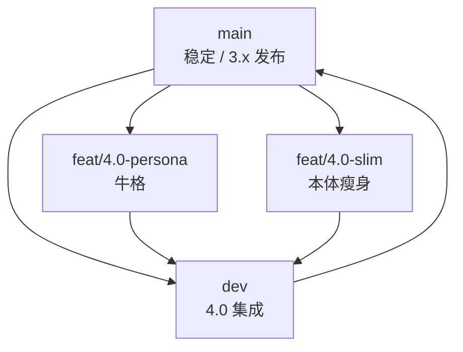

# 4.0 并行开发 · 分支约定

> 总览见 [pallas-4.0-roadmap.md](../architecture/pallas-4.0-roadmap.md)。**4.0** 含两条并行轨道：**牛格**与**本体瘦身**；集成分支为 **`dev`**。

## 分支模型



| 分支 | 用途 | 典型改动 |
| --- | --- | --- |
| `main` | 3.x 稳定线；hotfix 仍先进 `main` 或 cherry-pick | 与 4.0 无关的修复 |
| **`dev`** | **4.0 纯集成**：只合并两条子分支，不在此做大功能开发 | merge `feat/4.0-persona`、`feat/4.0-slim` |
| `feat/4.0-persona` | **牛格**全栈（见下表） | persona、LLM、KB/MCP、repeater 挂钩 |
| `feat/4.0-slim` | **本体瘦身** | 插件迁出、依赖拆分、CI/镜像、扩展仓脚手架 |

### `feat/4.0-persona`（牛格）范围

4.0 牛格 **不是**仅 3.9 群风格，而是整条接话智能线，至 4.0 发布前交付：

| 模块 | 文档 |
| --- | --- |
| 行为层 + 群风格（已部分落地） | [persona-reply-style](../architecture/persona-reply-style.md)、[group-style-persona](../architecture/group-style-persona.md) |
| LLM 语言层 + repeater fallback/polish | [persona-llm-roadmap](../architecture/persona-llm-roadmap.md)、[pallas-ai-service](../architecture/pallas-ai-service.md) |
| 明日方舟 KB / tools / MCP | [arknights-knowledge-mcp](../architecture/arknights-knowledge-mcp.md) |
| `features/persona`、`features/llm` | 主仓内核；**推理在 Pallas-Bot-AI** |
| `plugins/llm_chat` | 随时 @ 入口；4.0 经 `features/llm` 调 AI 仓统一 API |

**跨仓**：`feat/4.0-persona` 时期，主仓 PR 若依赖新 LLM API，须 **同周期** 在 [Pallas-Bot-AI](https://github.com/PallasBot/Pallas-Bot-AI) 提对应重构（或 PR 注明最低 AI 仓 tag）。见 [pallas-ai-service](../architecture/pallas-ai-service.md)。

**不在牛格分支**：玩法插件目录迁移、optional 依赖瘦身（属 `feat/4.0-slim`）。

### `feat/4.0-slim`（本体瘦身）范围

| 模块 | 说明 |
| --- | --- |
| 插件迁出清单 | duel / dream / maa / draw 等 → 扩展仓或 optional extra |
| `pyproject.toml` | 默认依赖缩小 |
| Docker / CI | 本体镜像与扩展包分构建 |
| 加载与 WebUI | 插件来源（core / extra / local）展示 |
| 迁移文档 | 3.x → 4.0 扩展包安装说明 |

**不在瘦身分支**：persona 算法、LLM prompt、群风格统计（属 `feat/4.0-persona`）。

## 日常流程

### 在子分支开发

```bash
# 牛格
git checkout feat/4.0-persona
# … 开发 …
uv run ruff check src/ && uv run pytest tests/features/test_persona.py …

# 本体瘦身
git checkout feat/4.0-slim
# … 开发 …
```

### 合入 dev（集成）

子分支 PR **目标分支选 `dev`**，不要直接 PR 到 `main`：

```bash
git checkout dev
git pull origin dev
git merge feat/4.0-persona   # 或通过 PR
# 解决冲突后
uv run ruff check src/
uv run pytest
```

两条子分支**可交替**合入 `dev`；冲突集中在 `pyproject.toml`、插件加载、文档时，按 [pallas-4.0-roadmap](../architecture/pallas-4.0-roadmap.md) 边界取舍。

### 4.0 发布

`dev` 验收通过后 **`dev` → `main`**，打 **4.0.0** tag；此前 `main` 仍可发 3.x patch。

## 与 3.x 的关系

- `feat/persona-reply-style` 已重命名为 **`feat/4.0-persona`**（历史提交保留）
- 3.x 必要修复：基于 `main` 开 `fix/*`，合并 `main` 后 **cherry-pick 或 merge 到 `dev` 与子分支**
- 新功能默认按轨道分流：接话/LLM → persona 分支；拆插件 → slim 分支

## PR 标题建议

```text
feat(persona): …     # feat/4.0-persona
feat(slim): …        # feat/4.0-slim
docs(4.0): …         # 任一分支
```

## 首次建分支（维护者）

本地已执行（供对照）：

```bash
git checkout main
git checkout -b dev

git checkout main
git checkout -b feat/4.0-slim

git branch -m feat/persona-reply-style feat/4.0-persona
```

首次推送（需维护者执行）：

```bash
git push -u origin dev
git push -u origin feat/4.0-slim
git push -u origin feat/4.0-persona
git push origin :feat/persona-reply-style   # 可选：删除远端旧名
```

## 相关文档

- [workflow.md](workflow.md) — 通用 PR / ruff 流程
- [pallas-4.0-roadmap.md](../architecture/pallas-4.0-roadmap.md)
