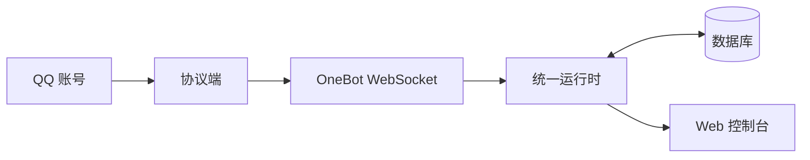

# 牛是怎么拼起来的

读完本页后，你能分清协议端、Bot、数据库与网页控制台各自管什么，并知道日常改配置该找哪一块。

## 四块组件

| 组件 | 职责 |
| --- | --- |
| 协议端 | 替 QQ 登录、收发消息（如 NapCat） |
| Pallas-Bot | 处理消息：复读、帮助、插件玩法等 |
| 数据库 | 存储语料、群配置、`bot_config` 等 |
| Web 控制台 | 改配置、看日志、装插件（路径 `/pallas/`） |

## 通信路径


- 协议端与 Pallas-Bot 通过 **OneBot WebSocket** 通信。
- Web 控制台与协议端管理页由 **同一 Bot 进程** 提供，无需另起服务。
- 日常改插件配置：控制台保存即可；装 / 卸官方扩展需重启 Bot。
- 端口、超管、数据库连接写在 `config/pallas.toml`；插件项写入 `data/pallas_config/webui.json`。

## 运行方式

Pallas-Bot 默认使用**统一运行时**：一个 Bot 进程接入本机全部 QQ 账号，协议端的反向 WebSocket 统一连到这个进程。它不需要 Redis，也不要求按账号拆分多个 Bot 进程。



统一运行时会将命令、聊天和后台任务分开调度：命令优先进入处理；同一会话按顺序执行；队列接近压力时先降低非必要的学习、检索等后台工作，而不是直接丢弃正常聊天消息。控制台可查看运行指标与队列状态。

常用命令：

```bash
uv run pallas run unified
uv run pallas status --mode unified
uv run pallas restart
```

修改协议端的 WebSocket 地址后，可通过协议端管理页热更新连接；不需要为了改地址重启协议容器。统一运行时默认使用 `7969` 端口，实际端口以 `config/pallas.toml` 为准。

当需要多机部署、账号级隔离或高可用时，才使用分片。此时分片是集群拓扑，而不是单机减少消息负载的默认手段；跨进程协调需要 Redis。详见[分片部署](/maintainer/deploy/sharded)。

## 成功信号

- 能说明：群消息先经协议端，再到 Bot；控制台改的是同进程配置。
- 知道改端口 / 超管找 `pallas.toml`，改插件与 AI 等日常项找控制台。
- 知道单机优先使用统一运行时，只有部署边界需要扩展时再用分片。

## 接下来做什么

- 第一次启动 → [快速开始](/guide/quickstart)
- 连 QQ → [连接 QQ](connect-qq.md)
- 配置落盘规则 → [配置从哪改](config.md)
